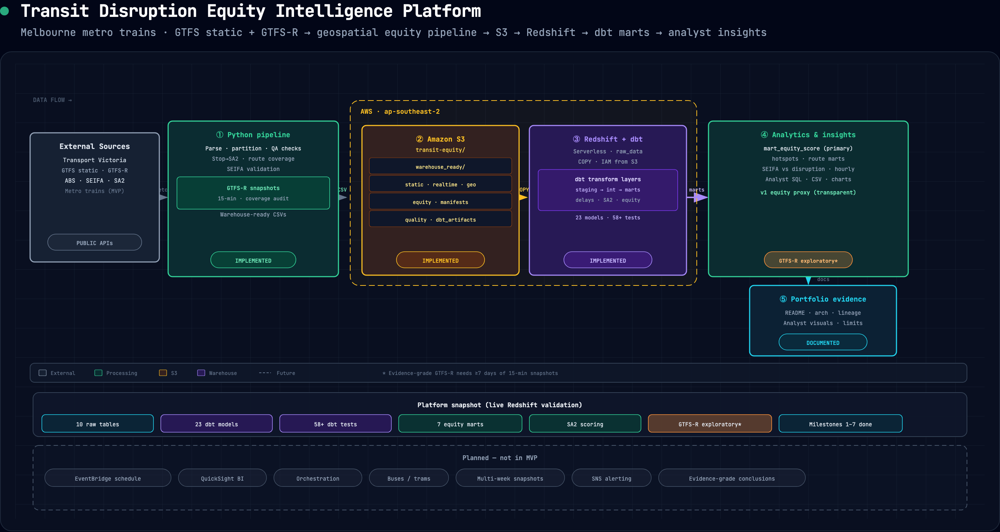

# Architecture



Interactive diagram: [`architecture_diagram.html`](architecture_diagram.html) (export toolbar: Copy / PNG / PDF).

Re-export PNGs with:

```bash
python3 scripts/export_architecture_diagram.py
```

Requires `pip install playwright && playwright install chromium`.

## Overview

The platform ingests Transport Victoria GTFS static and GTFS-Realtime feeds, maps Melbourne metro train stops to ABS SA2 geography, joins SEIFA 2021 disadvantage indicators, and builds dbt marts that rank SA2-level disruption equity impact using transparent, documented formulas.

```text
Transport Victoria APIs
  → Python ingestion + geospatial processing
  → Amazon S3 (warehouse-ready CSVs)
  → Amazon Redshift raw_data (COPY)
  → dbt staging / intermediate / marts
  → Analyst insight queries + portfolio docs
```

## Implemented MVP flow

1. **Ingestion:** GTFS static zip, GTFS-R trip updates and service alerts (Transport Victoria API).
2. **Geospatial:** Stop-to-SA2 mapping, route-to-SA2 coverage (`ingestion/build_stop_sa2_mapping.py`, etc.).
3. **Equity prep:** SEIFA SA2 validation and warehouse-ready outputs.
4. **Warehouse-ready:** Standardised CSV contracts + local quality checks + reconciliation.
5. **Cloud load:** S3 upload → Redshift `raw_data` COPY (IAM role).
6. **dbt:** Staging → intermediate event/exposure models → equity scoring marts.
7. **Analytics:** Insight SQL, analyst report, exported CSVs and chart artifacts.
8. **Evidence:** dbt lineage screenshots, architecture diagram, portfolio documentation.

## Key AWS components

| Component | Role |
| --- | --- |
| Amazon S3 | Warehouse-ready CSVs, manifests, quality reports, dbt artifacts |
| Amazon Redshift Serverless | `raw_data` tables + dbt-managed staging/intermediate/marts |
| IAM role | Redshift COPY from S3 |

Region default: `ap-southeast-2`. See `docs/s3_bucket_structure.md` and `docs/redshift_dbt_foundation.md`.

## Scoring marts

- `mart_transport_disruption_equity_score` — primary SA2/date/hour equity impact mart
- `mart_route_disruption_summary` — route daily disruption summary
- `mart_disruption_hotspots` — top-impact SA2 reporting layer
- `mart_sa2_daily_equity_summary` — daily SA2 rollup

Scoring logic: `docs/transport_disruption_equity_scoring.md`.

## Status

Milestones 1–7 implemented. GTFS-R analyst conclusions remain **exploratory** until ≥7 days of 15-minute snapshots are collected.

## Future enhancements

- Scheduled GTFS-R collection (EventBridge)
- QuickSight or similar BI dashboards
- Pipeline orchestration
- Buses and trams modes
- SNS alerting for data quality failures
